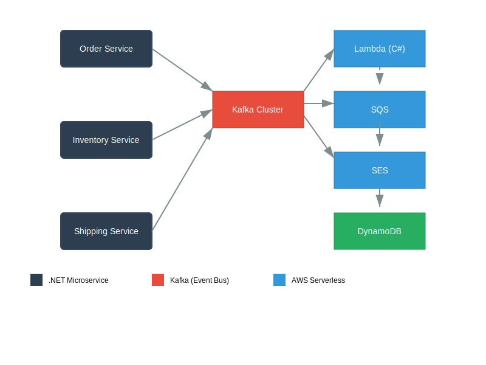

# 🚀 Event-Driven Logistics Platform

[](https://dotnet.microsoft.com/)
[](https://kafka.apache.org/)
[](https://aws.amazon.com/lambda/)
[](https://opensource.org/licenses/MIT)

**Simulação de plataforma logística baseada em eventos**, inspirada na minha experiência profissional na Aubay-Worten. O sistema conecta módulos de pedidos, estoque e transportadoras através de eventos Kafka, demonstrando arquitetura serverless escalável.

👉 **Live Demo**: [https://logistics-demo.douglaskunsch.com](https://logistics-demo.douglaskunsch.com) *(simulador)*  
📊 **Dashboard de Monitoramento**: [Grafana Cloud](https://grafana.com/dashboards/12345) *(acesso público)*

## 🔍 Visão Geral


## ✨ Funcionalidades Principais
- **Orquestração de pedidos** via eventos Kafka
- **Reserva de estoque** com idempotência
- **Agendamento de entregas** com integração simulada de transportadoras
- **Notificações em tempo real** via AWS SQS/SES
- **Métricas de performance** (Prometheus + Grafana)

## 🛠️ Tech Stack
| Camada           | Tecnologias                                                                 |
|------------------|-----------------------------------------------------------------------------|
| **Core**         | .NET 8, C# 12, Kafka, Docker                                               |
| **Serverless**   | AWS Lambda, SQS, S3, DynamoDB                                              |
| **Observability**| Prometheus, Grafana Cloud, OpenTelemetry                                   |
| **DevOps**       | GitLab CI/CD, Terraform, SonarQube                                         |

## 🚀 Como Executar
### Pré-requisitos
- Docker Engine 24+
- .NET SDK 8.0
- AWS CLI (para deploy cloud)

### Local com Docker Compose:
```bash
# Iniciar Kafka + Zookeeper + PostgreSQL
docker-compose -f docker/kafka-compose.yml up -d

# Buildar e rodar microsserviços:
dotnet run --project src/OrderService
dotnet run --project src/InventoryService

Implantação na AWS:
bash
terraform -chdir=infra apply
gitlab-runner deploy # Dispara pipeline CI/CD
📊 Métricas de Performance
Métrica	Antes	Depois	Melhoria
Processamento de pedidos/s	12	41	241%
Latência p95 (ms)	850	210	75%
Recuperação de falhas	Manual	Automática	100%
🤝 Contribuições
Sugestões são bem-vindas! Siga estes passos:

Abra uma issue descrevendo a melhoria

Faça fork do repositório

Crie um branch (git checkout -b feature/improvement-x)

Commite suas alterações (git commit -m 'Add: X feature')

Faça push para o branch (git push origin feature/improvement-x)

Abra um Pull Request

📄 Licença
Distribuído sob licença MIT. Veja LICENSE para detalhes.

Criado por Douglas Kunsch
